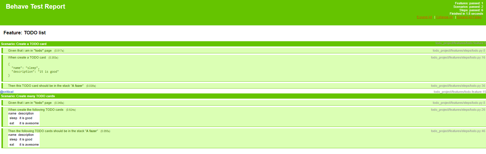

# TODO Behave BDD

Project focused on BDD learning and practicing, which is a TODO application been tested.

## Scenario: Create a TODO card

The challenge is ensure that TODO cards are created after the creating logic have been executed.

## Scenario: Create many TODO cards

For this one, the purpose is ensure the creation of multiple TODO cards.

<h2>Libraries in this project</h2>

- Behave
- Selenium
- Ipdb
- behave-html-formatter

<h2>HTML Behave reports</h2>

  

